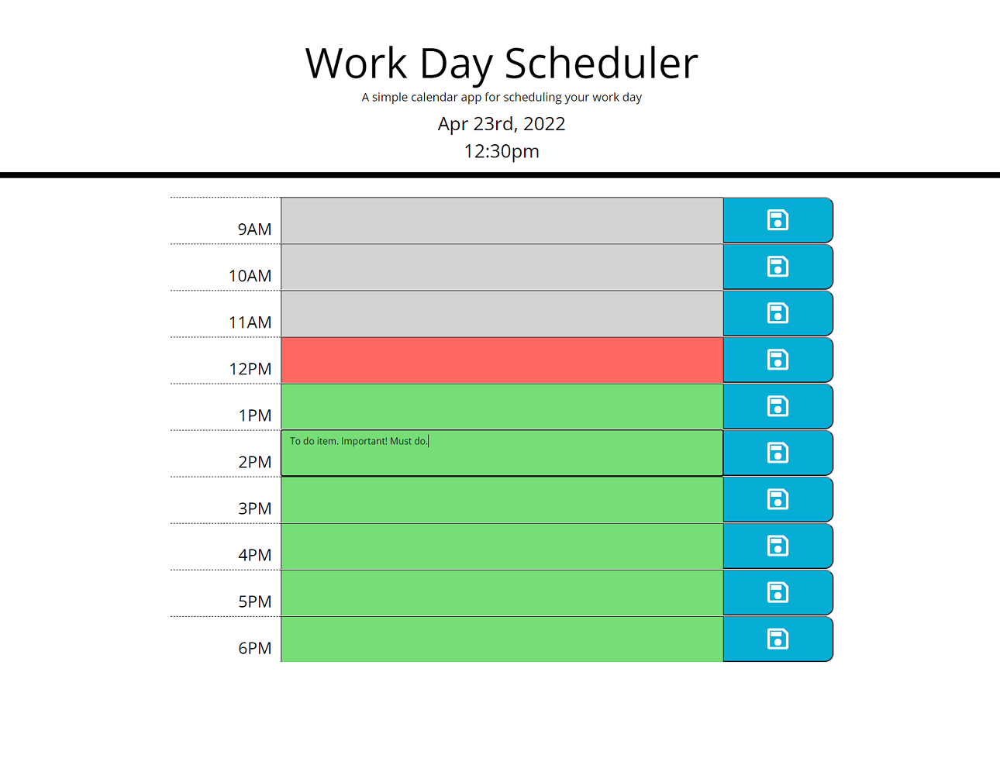

# Day Planner

This is a basic HTML, CSS, and Javascript page.

This page displays the current date and time at the top of the page. It has a field of text input areas for the user to write plans for the day. These are saved and will persist upon refreshing the browser. The colors of each hour's row will change depending on whether that hour has past, is the current hour, or is in the future.

[Deployed page](https://mendelism.github.io/day-planner/)